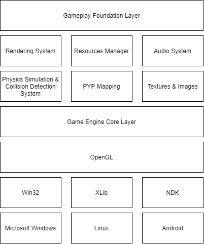

# BPM Game Engine

**BPM Game Engine** is a open source game engine written in C++ that emerged to support the development of digital games based on business process. Business process-based games are characterized by games that present a business process in a playful way, thus allowing the understanding and learning of its operation in a fun and engaging way.

The BPM Game Engine consists of a set of runtime components, including a real-time rendering engine in OpenGL, a platform-independent window-system and user input, physics simulation and collision detection system, animation system, and the gameplay foundation layer which supports the creation of game objects and gameplay mechanics. However, its greatest advantage lies in its ability to extract information from business process models and transform them into data structures which represent a sequence of player objectives and game objects.

###### BPM Game Engine Architecture

## Getting Starting

1. Go to https://github.com/Keshizin/tcc-bpmge to clone BPM Game Engine repo.

         $ git clone https://github.com/Keshizin/tcc-bpmge.git

2. After cloning the repo, execute make to build the project.

         $ make all

This will generate static library `bpmge.lib` that you can use to link to your game project. For more details, check the development guide (inside the `docs` directory) to find out how to create games using BPM Game Engine.

This project can be compiled using the following compilers:

* GCC
* Microsoft Visual Studio
* MinGW

## Documentation

Within the `docs` directory includes a set of documents to support the development of games using BPM Game Engine.

## Contributing

- `Explain here the Git Workflow`
- `Explain here the Branches`
- `Explain here how to pull requests`

## License

BPM Game Engine is licensed under the MIT License.
